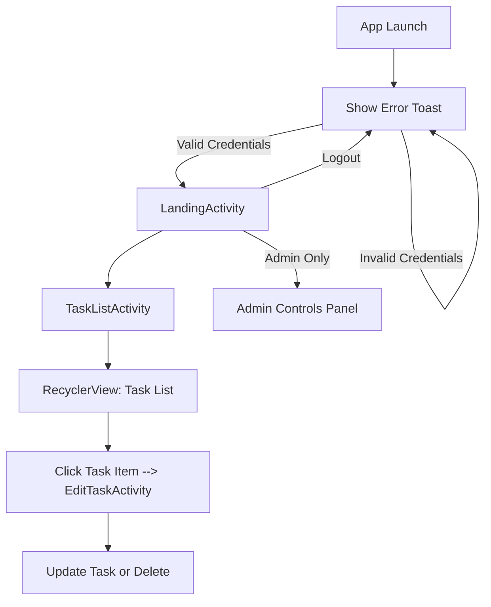
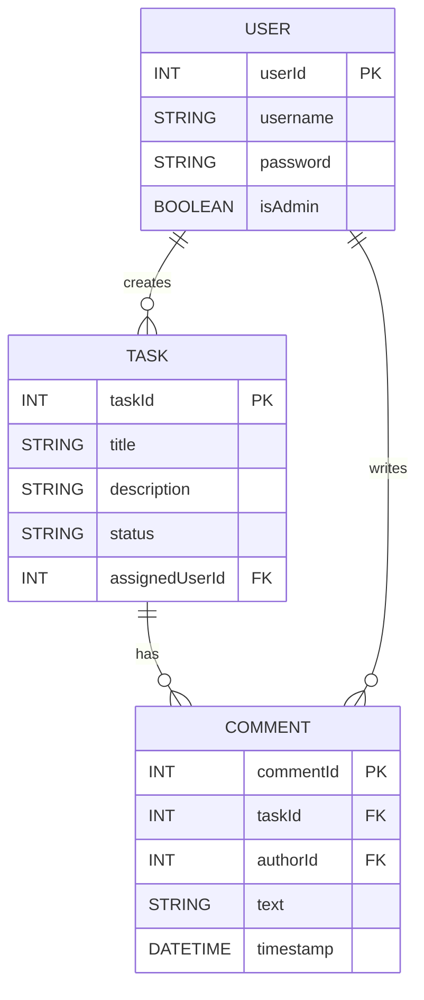

# TaskTracker

## Overview
TaskTracker is a simple team-based to-do list mobile application for Android. It uses Room database for persistence, LiveData for UI updates, and includes basic authentication and admin features.

### Edit
This project was originally created as part of a team assignment for an Android development course.
All commits after 09/03/2025 will be made by Janaye J as I want to build on this project for my portfolio.
The original repository can be found here: https://github.com/JanayeJackson/ElevateWebSolutionsAndroidStudio

---
## User Stories
- As a user, I want to log in so I can access my tasks
- As a user, I want to see a list of my tasks
- As a user, I want to add, edit, and delete tasks
- As an admin, I want to access admin-only features such as clearing all tasks and managing users
- As a user, I want the task list to update automatically
- As a developer, I want to test database and navigation logic

---
## PLANNED Layout

---
## PLANNED Entity Layout
The assignment MUST use a database and must have at least three tables

