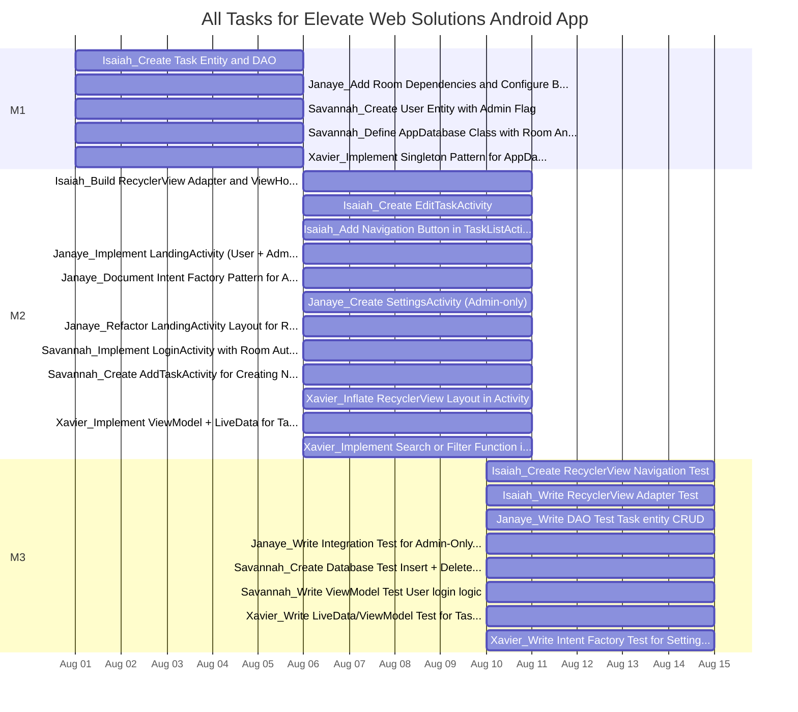
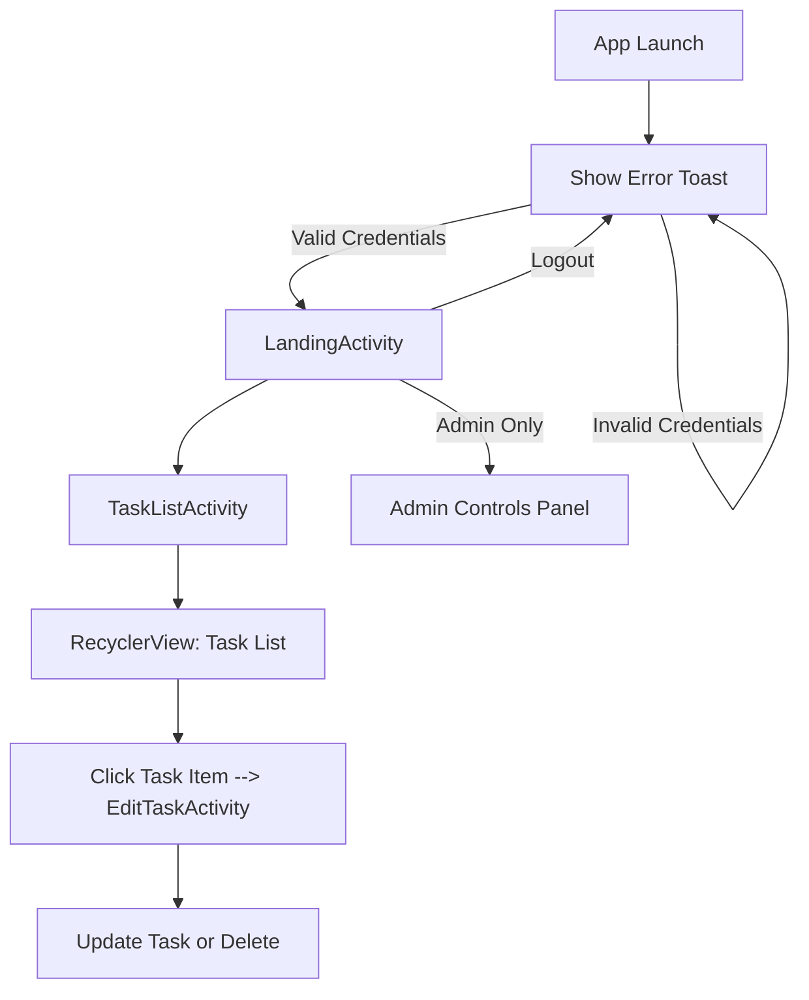
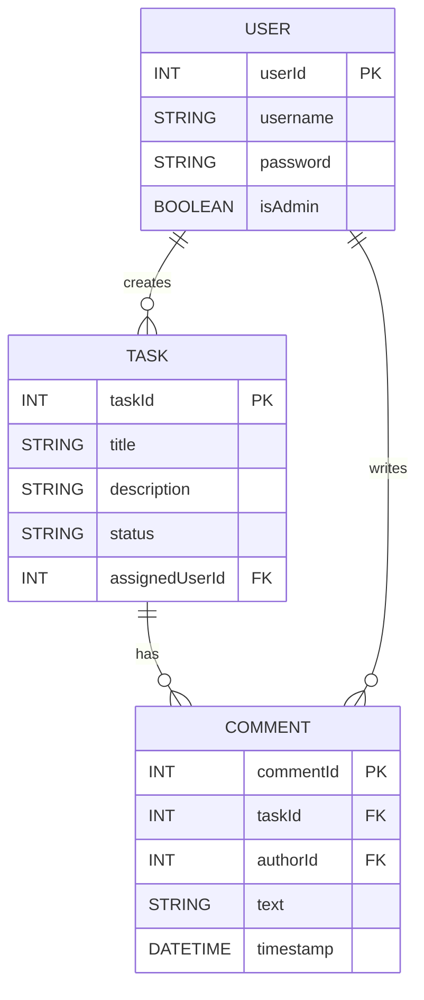

# TaskTracker

## Overview
TaskTracker is a simple team-based to-do list mobile application for Android. It uses Room database for persistence, LiveData for UI updates, and includes basic authentication and admin features.

---
## Team Members
- **Janaye J**
- **Savannah K**
- **Isaiah S**
- **Xavier M**

---
## Rubric Strategy
### Required (110 pts)
- Room DB w/ 3 tables, Activities, Login, Landing Page, PRs, Unit Tests

### Optional (94 pts)
- RecyclerView (10)
- LiveData (10)
- Intent Factory (10)
- Intent Tests (20)
- Database Tests (20)
- External Library (e.g. Glide) (16)
- Fragments (8)

---
## Features (Minimum Viable Product)
- User login via Room DB (with admin flag)
- Task list view with RecyclerView
- Add/Edit/Delete tasks
- Admin-only content on landing page
- ViewModel + LiveData integration
- Unit tests and database tests
- Intent factory pattern

---
## Timeline

---
## Database Entities
### User
- `userId`: Int (Primary Key)
- `username`: String
- `password`: String
- `isAdmin`: Boolean

### Task
- `taskId`: Int (Primary Key)
- `title`: String
- `description`: String
- `status`: String

---
## Activities
- **LoginActivity**: User enters credentials
- **LandingActivity**: Displays user info and admin-only controls if `isAdmin = true`
- **TaskListActivity** (RecyclerView): Lists tasks with support for navigation

---
## Architecture
- **Room Database**: For persistence of tasks and users
- **MVVM**: ViewModel + LiveData bound to UI
- **Repository Pattern**: For clean data access
- **Intent Factory Pattern**: Static creation of activity Intents

---
## Milestones & Timeline
- **Milestone 1 (Due Aug 5)**: Project setup, Room DB, User/Task entities
- **Milestone 2 (Due Aug 11)**: UI, task list, login, admin views
- **Milestone 3 (Due Aug 15)**: Tests, polish, final walkthrough video

---
## User Stories
- As a user, I want to log in so I can access my tasks
- As a user, I want to see a list of my tasks
- As a user, I want to add, edit, and delete tasks
- As an admin, I want to access admin-only features such as clearing all tasks and managing users
- As a user, I want the task list to update automatically
- As a developer, I want to test database and navigation logic

---
## Layout

---
## Entity Layout
The assignment MUST use a database and must have at least three tables

## Activity Assignments by Team Member

### Janaye J
1. **LandingActivity**  
   Responsible for implementing user/admin view logic and navigation.
2. **SettingsActivity (Admin)**  
   Creates a new screen only accessible to admins for toggling app-level controls.
3. **LoginActivity Intent Refactor**  
   Implements or updates intent logic for launching LoginActivity (via factory or navigation).

---

### Savannah K
1. **LoginActivity**  
   Builds the authentication UI and connects it to the Room database.
2. **AddTaskActivity**  
   Implements an interface for creating new tasks and writing to the database.
3. **User Login ViewModel Logic**  
   Supports user authentication through ViewModel logic.

---

### Isaiah S
1. **EditTaskActivity**  
   Adds the ability for users to open a task and make updates to its content or status.
2. **RecyclerView Adapter/ViewHolder**  
   Handles rendering tasks in a scrollable list UI.
3. **Navigation Test to EditTaskActivity**  
   Verifies intent behavior, confirming task tap opens the correct screen.

---

### Xavier M
1. **TaskListActivity**  
   Displays all tasks for the logged-in user, integrating with RecyclerView and LiveData.
2. **Settings Toggle Logic (Admin)**  
   Implements logic for toggling settings within SettingsActivity for an admin.
3. **IntentFactory for SettingsActivity**  
   Creates and tests reusable intent creation logic for activity navigation.

---
## Unit Test Contributions by Team Member

### Janaye J
1. Write DAO Test: Task entity CRUD
2. Write Integration Test for Admin-Only Access to SettingsActivity

### Savannah K
1. Create Database Test: Insert + Delete User
2. Write ViewModel Test: User login logic

### Isaiah S
1. Create RecyclerView Navigation Test
2. Write RecyclerView Adapter Test

### Xavier M
1. Write LiveData/ViewModel Test for Task List updates
2. Write Intent Factory Test for SettingsActivity launch

## Task Breakdown by Team Member (Likely to change)

### Janaye J
- **Add Room Dependencies and Configure Build Files**  
  _Milestone_: M1  
  _Rubric Component_: Room DB Setup_

- **Implement LandingActivity (User + Admin Views)**  
  _Milestone_: M2  
  _Rubric Component_: Activity Design + Admin Logic_

- **Document Intent Factory Pattern for Activities**  
  _Milestone_: M2  
  _Rubric Component_: Code Design Pattern_

- **Write DAO Test: Task entity CRUD**  
  _Milestone_: M3  
  _Rubric Component_: Unit Testing_

- **Create SettingsActivity (Admin-only)**  
  _Milestone_: M2  
  _Rubric Component_: Admin Functionality_

- **Write Integration Test for Admin-Only Access to SettingsActivity**  
  _Milestone_: M3  
  _Rubric Component_: Admin Access Validation_

- **Refactor LandingActivity Layout for Role-Based UI Separation**  
  _Milestone_: M2  
  _Rubric Component_: UI + Layout Logic_

### Savannah K
- **Create User Entity with Admin Flag**  
  _Milestone_: M1  
  _Rubric Component_: Room Entity Definition_

- **Implement LoginActivity with Room Authentication**  
  _Milestone_: M2  
  _Rubric Component_: Login Feature_

- **Create Database Test: Insert + Delete User**  
  _Milestone_: M3  
  _Rubric Component_: Unit Testing_

- **Define AppDatabase Class with Room Annotations**  
  _Milestone_: M1  
  _Rubric Component_: Room DB Setup_

- **Write ViewModel Test: User login logic**  
  _Milestone_: M3  
  _Rubric Component_: Unit Testing_

- **Create AddTaskActivity for Creating New Tasks**  
  _Milestone_: M2  
  _Rubric Component_: Create Task Feature_

### Isaiah S
- **Create Task Entity and DAO**  
  _Milestone_: M1  
  _Rubric Component_: Room Entity and DAO_

- **Build RecyclerView Adapter and ViewHolder for Tasks**  
  _Milestone_: M2  
  _Rubric Component_: RecyclerView Functionality_

- **Create RecyclerView Navigation Test**  
  _Milestone_: M3  
  _Rubric Component_: Navigation Testing_

- **Write RecyclerView Adapter Test**  
  _Milestone_: M3  
  _Rubric Component_: UI Component Testing_

- **Create EditTaskActivity**  
  _Milestone_: M2  
  _Rubric Component_: Activity to Edit Tasks_

- **Add Navigation Button in TaskListActivity to Launch AddTaskActivity**  
  _Milestone_: M2  
  _Rubric Component_: Navigation Integration_

### Xavier M
- **Implement Singleton Pattern for AppDatabase Access**  
  _Milestone_: M1  
  _Rubric Component_: Singleton Architecture_

- **Inflate RecyclerView Layout in Activity**  
  _Milestone_: M2  
  _Rubric Component_: Layout + ViewHolder Integration_

- **Implement ViewModel + LiveData for Task List**  
  _Milestone_: M2  
  _Rubric Component_: MVVM Integration_

- **Write LiveData/ViewModel Test for Task List updates**  
  _Milestone_: M3  
  _Rubric Component_: LiveData Testing_

- **Write Intent Factory Test for SettingsActivity launch**  
  _Milestone_: M3  
  _Rubric Component_: Intent Factory Testing_

- **Implement Search or Filter Function in TaskListActivity**  
  _Milestone_: M2  
  _Rubric Component_: Filter/Search Feature_

